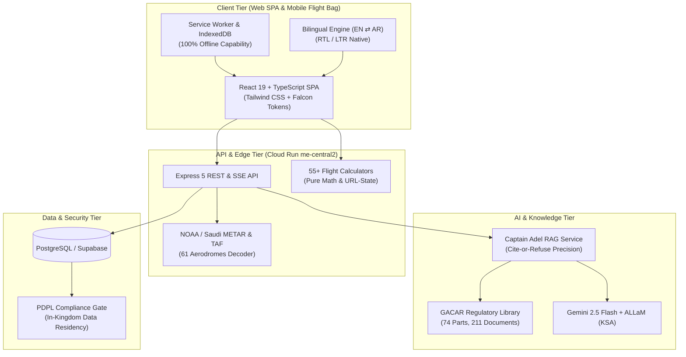
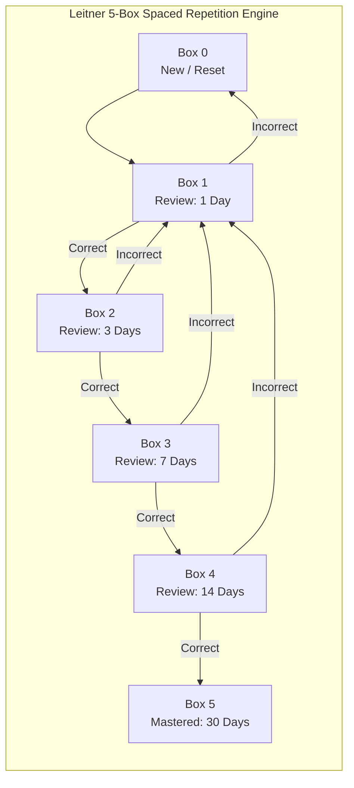

<div align="center">

# ✈️ **Fly GACA**
### The Modern Flight Intelligence & Academic Platform for Saudi Civil Aviation
#### المنصة الرقمية المتكاملة لعلوم ولوائح الطيران المدني السعودي

<p align="center">
  
  
  
  
  
  
  
  
  
  
  
</p>

[**🌐 Web App (flygaca.com)**](https://flygaca.com) • 
[**🤖 Captain Adel AI**](https://ask.flygaca.com) • 
[**📱 iOS Apps**](https://github.com/iflygaca/FlyGACA-ios) • 
[**🏢 Master Office**](https://github.com/iflygaca/Office) • 
[**🤗 Hugging Face**](https://huggingface.co/flygaca)

</div>

---

> [!IMPORTANT]
> **Independent Educational Ecosystem.** Fly GACA is an independent educational initiative and is not affiliated with, endorsed by, or operated by the General Authority of Civil Aviation (GACA) or the Government of Saudi Arabia. The authoritative source for all civil aviation regulations is always [gaca.gov.sa](https://gaca.gov.sa).
> 
> **فلاي قاكا منظومة تعليمية مستقلة.** وهي غير تابعة للهيئة العامة للطيران المدني (GACA) ولا معتمدة منها. المصدر الرسمي والمعتمد لجميع لوائح وأنظمة الطيران المدني هو موقع الهيئة الرسمي دائمًا.

---

## 🏗 Fly GACA Family Repositories

| Repository | Role | Tech Stack | Status |
|:---|:---|:---|:---:|
| **[FlyGACA](https://github.com/iflygaca/FlyGACA)** | Main web platform, 55+ flight tools, 74 GACAR Parts & ground school | React 19, Vite, Express 5, TypeScript | 🚀 Live |
| **[Captain-Adel](https://github.com/iflygaca/Captain-Adel)** | AI flight instructor service with cite-or-refuse GACAR grounding | Node.js, Express, Gemini RAG, ALLaM, Python | 🚀 Live |
| **[FlyGACA-ios](https://github.com/iflygaca/FlyGACA-ios)** | Flagship native iOS app suite (ELPT, AIP, Flight Deck) | Swift 5.9+, SwiftUI, SwiftData, SPM | 📱 TestFlight |
| **[FlyGACA-Family](https://github.com/iflygaca/FlyGACA-Family)** | Family root & ecosystem hub contract | JSON Schemas, Contracts, Shared Assets | 🦅 Hub |
| **[Office](https://github.com/iflygaca/Office)** | Operations, governance, KSA compliance & headless PDF pipeline | Markdown OS, ZATCA UBL 2.1, Headless Chromium | 🏢 Active |

---

## 🎯 What's Inside?

Fly GACA is the **all-in-one flight platform** built specifically for Saudi civil aviation:

- 📚 **Deep GACAR Regulatory Library:** 74 GACAR Parts indexed with 211 reference documents, section anchors (`§91.155`), and sub-millisecond client lookup.
- 🤖 **Captain Adel AI Flight Instructor:** Multi-provider RAG (Gemini 2.5 Flash + in-Kingdom ALLaM) with strict "Cite-or-Refuse" precision.
- 🧮 **55+ Pure Flight Calculators:** Crosswind components, true airspeed (TAS), weight & balance CG envelopes, density altitude, fuel planning, and runway performance.
- 🎓 **Part 141 Ground School:** 1,000+ bilingual exam questions across 26 banks with Leitner spaced-repetition flashcards.
- 🌤️ **Live Saudi Aerodrome Weather:** Real-time METAR/TAF decoder for 61 Saudi aerodromes with flight category indicators (VFR, MVFR, IFR, LIFR).
- 📱 **100% Offline Capable:** Complete mobile flight bag capability with zero internet dependency in the cockpit.

---

## 🏛️ System Architecture



---

## 🎓 Spaced Repetition (SRS) Engine Flow

Fly GACA implements an academically rigorous Leitner 5-box spaced-repetition algorithm verified across web and iOS implementations:



---

## ⚡ Quick Start in 30 Seconds

### 1️⃣ Clone & Install
```bash
git clone https://github.com/iflygaca/FlyGACA.git
cd FlyGACA && npm install
```

### 2️⃣ Set Up Environment
```bash
cp .env.example .env.local
# Add GEMINI_API_KEY (optional — works in mock mode without it)
```

### 3️⃣ Launch Local Dev Server
```bash
npm run dev
# 🚀 Running at http://localhost:5173
```

---

## 🌟 Platform Feature Matrix

| Feature | Description | Coverage / Metrics | Status |
|:---|:---|:---|:---:|
| **GACAR Regulations Index** | Searchable regulatory catalog with AST anchors and cross-references | 74 Parts, 211 Documents | ✅ Production |
| **Captain Adel AI** | Grounded flight instructor with cite-or-refuse precision and SSE stream | Arabic (ALLaM) + English (Gemini) | ✅ Production |
| **Pure Flight Calculators** | Deterministic aerodynamic and navigation algorithms with URL-state sharing | 55+ Verified Calculators | ✅ Production |
| **Aero Weather Center** | Real-time METAR/TAF parser, flight categories, and crosswind calculations | 61 Saudi Aerodromes | ✅ Production |
| **Part 141 Exam Prep** | Timed mock exams, question explanations, and category breakdowns | 1,000+ Questions, 26 Banks | ✅ Production |
| **B2B Academy Suite** | Cohort readiness tracking, instructor analytics, and seat licensing | ATOs, Airlines & ANSPs | ✅ Production |
| **Offline Flight Bag** | Full local persistence for cockpit use without cellular connectivity | 100% Offline Capable | ✅ Production |
| **KSA Data Residency** | Immutable audit trails and zero PII logging under Saudi PDPL | `me-central2` (Dammam) | ✅ Production |

---

## 🧮 Flight Calculators Catalog (55+ Pure Tools)

<details>
<summary><b>Click to expand flight calculator categories & tools</b></summary>

| Category | Tools & Calculators | Input Parameters | GACAR Reference |
|:---|:---|:---|:---|
| **Altimetry & Atmosphere** | Density Altitude, Pressure Altitude, ISA Deviation, True Altitude | QNH, OAT, Field Elevation | GACAR §91.119 |
| **Airspeed & Dynamics** | CAS to TAS, Mach Number, Sound Speed, Dynamic Pressure | IAS, CAS, Altitude, Temp | GACAR §91.117 |
| **Wind & Drift** | Crosswind/Headwind Component, Wind Correction Angle, Groundspeed | Runway Heading, Wind Dir/Speed | GACAR §91.155 |
| **Weight & Balance** | Center of Gravity (CG) Envelope, Zero Fuel Weight, Moment Arm | Station Weights, Empty Weight | GACAR §91.103 |
| **Fuel & Range** | Fuel Burn Rate, Minimum VFR/IFR Reserves, Bingo Fuel, Endurance | Consumption Rate, Contingency | GACAR §91.167 |
| **Runway Performance** | Takeoff Distance Factor, Landing Roll, Climb Gradient, Obstacle Clearance | Weight, Density Alt, Slope | GACAR §91.103 |

</details>

---

## 🛠 Tech Stack

```
┌────────────────────────────────────────────────────────┐
│                      Client Layer                      │
│     React 19  •  TypeScript Strict  •  Vite 6          │
│     Tailwind CSS  •  Falcon Design Tokens  •  i18n     │
├────────────────────────────────────────────────────────┤
│                      Backend Layer                     │
│     Express 5  •  Node.js 20+  •  Cloud Run            │
│     Server-Sent Events (SSE)  •  Zod Validation        │
├────────────────────────────────────────────────────────┤
│                   Intelligence Layer                   │
│     Captain Adel  •  Gemini 2.5 Flash  •  ALLaM (KSA)  │
│     Dense Vector (BGE-M3)  •  Lexical Inverted (BM25)  │
├────────────────────────────────────────────────────────┤
│                   Data & Storage Layer                 │
│     PostgreSQL  •  Supabase pgvector  •  IndexedDB     │
│     Forward-Only Migrations  •  PDPL-Compliant         │
└────────────────────────────────────────────────────────┘
```

---

## 🏗 Project Directory Structure

```
FlyGACA/
├── src/                    # React 19 Client SPA (Vite)
│   ├── components/         # Reusable Falcon design UI components
│   ├── pages/              # Route-based page views
│   ├── lib/                # Deterministic flight calculator engines
│   └── i18n/               # Bilingual English/Arabic translations
├── server/                 # Express 5 API Backend
│   ├── routes/             # RESTful API endpoints & SSE chat
│   ├── middleware/         # Security, CORS, and auth gates
│   └── brain/              # AI retrieval and grounding engine
├── content/                # Content authoring pipelines
│   └── regulations/        # 74 GACAR Parts (Authoring Markdown AST)
├── docs/                   # Architectural runbooks and B2B specs
│   └── b2b/                # Part 141 ATO Academy platform
├── screenshots/            # Automated screenshot pipelines
├── terraform/              # GCP cloud monitoring & uptime alerts
└── tests/                  # Vitest suite (2,392+ unit tests) & Playwright e2e
```

---

## 💻 Developer Commands

```bash
# 🧪 Quality & Testing
npm run lint              # ESLint strict validation
npm run typecheck         # Full TypeScript strict verification
npm test                  # Run Vitest test suite (2,392+ tests)
npm run test:watch        # Interactive watch mode for test suites
npm run test:e2e          # Playwright end-to-end browser tests
npm run verify            # Complete pre-flight validation bundle

# 🚀 Development
npm run dev               # Vite local dev server with API mock
npm run dev:api           # Express API server on :3000
npm run dev:db            # Start local PostgreSQL container

# 📦 Build & Production
npm run build             # Compile production web client bundle
npm run build:api         # Build Express API production artifacts
npm run preview           # Locally test the production build

# 🧮 Regulatory & Content Pipelines
npm run parse:regulations # Compile content/regulations/*.md into lookup JSON
npm run tools:test        # Verify 55+ flight calculator math vectors
```

---

## 🇸🇦 PDPL Compliance & Data Residency

- ✅ **In-Kingdom Data Residency:** Primary database and compute hosted in Saudi Arabia (`me-central2`).
- ✅ **Zero PII Logging:** Student chat interactions and calculations are scrubbed of personal identifiers.
- ✅ **Immutable Audit Trail:** Strict record of regulatory citations without user tracking.
- ✅ **Right to Erasure:** Fully compliant with Saudi Personal Data Protection Law (PDPL).

---

## 📖 Sub-Documentation Directories

- **[`content/regulations/README.md`](./content/regulations/README.md)** — GACAR Markdown AST compiler & lookup tables.
- **[`docs/b2b/README.md`](./docs/b2b/README.md)** — B2B Part 141 Flight Academy platform & cohort analytics.
- **[`screenshots/README.md`](./screenshots/README.md)** — Automated screenshot & promotional asset pipeline.
- **[`terraform/README.md`](./terraform/README.md)** — Infrastructure-as-Code & GCP Cloud SLO monitoring.
- **[`CLAUDE.md`](./CLAUDE.md)** — AI contributor coding standards & repo conventions.

---

## 🧑‍💻 Contributing

We warmly welcome contributions from pilots, software engineers, aviation safety experts, and educators:

1. **Fork** the repository (`https://github.com/iflygaca/FlyGACA`)
2. **Create** your feature branch (`git checkout -b feat/ground-school-module`)
3. **Commit** your changes (`git commit -m "feat: add weight and balance envelope visualizer"`)
4. **Test** thoroughly (`npm run verify`)
5. **Push** to your branch and open a **Pull Request**

See [CONTRIBUTING.md](./CONTRIBUTING.md) for detailed guidelines.

---

## 📜 License

Software components are released under the **MIT License**. Civil aviation regulations are property of the General Authority of Civil Aviation (GACA) and presented for educational purposes.

---

<div align="center">

**Built for pilots. Grounded in regulations. Powered by AI.**

[Website](https://flygaca.com) · [Ask Captain Adel](https://ask.flygaca.com) · [Report an Issue](https://github.com/iflygaca/FlyGACA/issues) · [Star ⭐](https://github.com/iflygaca/FlyGACA)

🇸🇦 صنع في السعودية · Made in Saudi Arabia

</div>
