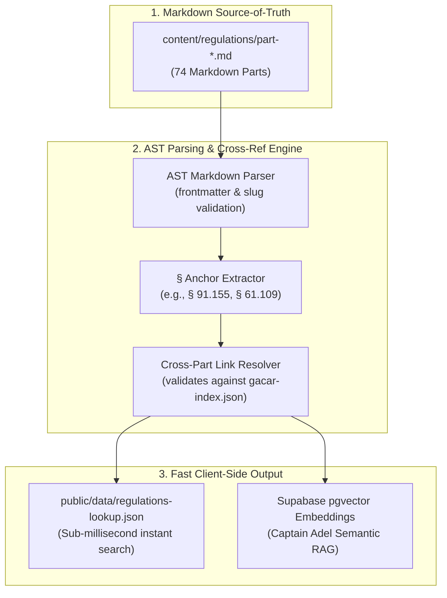

<div align="center">

# 📖 Regulatory Markdown Corpus & AST Compiler
### Authoring Source-of-Truth, Linting & Compilation for 74 GACAR Parts
#### المصدر المرجعي للوائح الطيران المدني السعودي · المترجم الهيكلي · التحقق الآلي

<p align="center">
  
  
  
  
  
</p>

[**🌐 Main Platform**](../../README.md) • [**🤖 Captain Adel AI**](https://ask.flygaca.com) • [**📚 GACAR Official**](https://gaca.gov.sa)

</div>

---

## 🧭 Purpose & Compilation Pipeline

This directory serves as the **authoring source-of-truth** for Fly GACA's complete regulatory library. Each GACAR Part is maintained as a clean, version-controlled Markdown file (`part-<n>.md`).

An automated AST compilation pipeline parses these files, extracts internal cross-references, validates regulatory citations against the canonical index (`public/data/gacar-index.json`), and generates an optimized JSON lookup table (`public/data/regulations-lookup.json`) for instant client-side rendering.



---

## 📚 GACAR Regulatory Categories

The 74 indexed GACAR Parts are categorized into 6 core operational domains:

| Category | Parts Range | Example Regulations | Focus Area |
|:---|:---|:---|:---|
| **Airspace & Flight Rules** | Parts 91, 93, 97, 101 | General flight rules, VFR/IFR minima, special use airspace | Navigation & pilot operations |
| **Flight Crew Licensing** | Parts 61, 63, 65, 67 | Student, PPL, CPL, ATPL, flight dispatchers, medicals | Certification standards |
| **Commercial Air Operations**| Parts 119, 121, 125, 135| Air carrier certification, large aircraft, on-demand charters | Airline & commercial safety |
| **Training & Academies** | Parts 141, 142, 147 | Pilot schools, training centers, maintenance technician schools| Part 141 ATO Ground schools |
| **Airworthiness & Maintenance**| Parts 21, 23, 25, 43, 145| Aircraft certification, maintenance, repair stations | Engineering & technical ops |
| **Airports & Infrastructure** | Parts 139, 171, 172 | Aerodrome certification, navigational facilities, ATC | Ground & airport operations |

---

## 📋 Frontmatter Specification

Every Part markdown file must start with a strictly validated YAML frontmatter header:

```yaml
---
part: '91'                 # String representation of Part number
partNum: 91                # Integer used for sorting and numeric lookup
title: General Operating and Flight Rules
category: airspace         # Regulatory category matching gacar-index.json
slug: part-91              # Must match filename stem exactly
---
```

---

## 🔗 Cross-Referencing Syntax & Rules

1. **Prose Part References:** Referenced automatically in text (e.g. `"... complies with Part 121 requirements ..."`).
2. **Explicit Markdown Links:** Relative links to sibling files (e.g. `[Part 121](./part-121.md)`).
3. **Section Number Anchors:** Extracted automatically via regex pattern `§\s*(\d+\.\d+)` (e.g. `§ 91.205`).

> [!NOTE]
> All referenced Parts must exist in the canonical GACAR registry. Any non-existent Parts (e.g. `Part 999`) will fail the pre-commit AST compilation gate.

---

## ⚡ Local Validation & Compilation Commands

```bash
# 1. Lint markdown files for style and formatting
npm run lint:md

# 2. Compile and validate cross-references to regulations-lookup.json
npm run parse:regulations

# 3. Optional: Upsert embeddings to Supabase pgvector
npm run embeddings:upsert
```

---

<div align="center">

<sub>🇸🇦 صنع في السعودية · Made in Saudi Arabia</sub>

</div>
